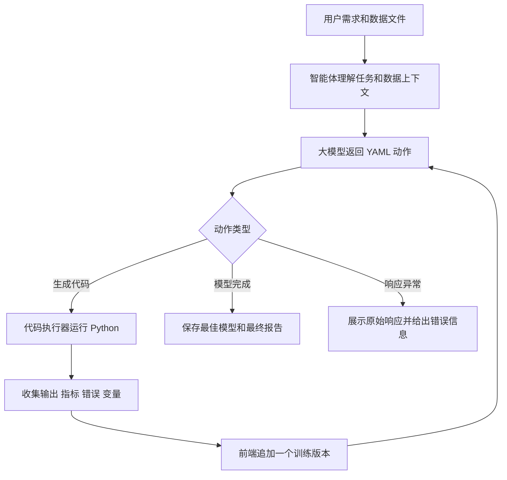

# 机器学习模型迭代智能体

> 一个面向真实建模任务的智能工作台：用户只需要上传数据、描述目标，它就能生成建模代码、训练模型、读取结果并继续迭代。

机器学习模型迭代智能体是一个本地优先的 AI 建模系统。它把大模型的代码生成能力、Python 数据科学工具链和可视化 Web 工作台组合在一起，让用户可以用自然语言发起回归、分类、光谱建模、小样本验证、盲样预测等任务。

项目的重点不再是一次性生成分析报告，而是围绕“模型性能是否达标”持续迭代。每一轮都会生成可执行代码、训练模型、输出指标、记录版本结果，并根据反馈继续改进方案。前端页面提供三栏工作台：左侧提交训练需求和上传文件，中间查看每一版训练结果，右侧保存模型配置和查看最终报告。


## 核心能力

- 自然语言建模：直接描述训练需求、目标指标、验证方式和业务约束。
- 自动生成代码：大模型按 YAML 动作格式返回 Python 建模代码，并在 Notebook 环境中执行。
- 多轮模型迭代：如果指标没有达到预期，智能体会根据执行反馈继续改进特征、模型和验证策略。
- 训练版本追踪：前端可以查看每一轮的输出、代码、反馈、错误和原始模型响应。
- 模型配置保存：浏览器本地保存 API Key、接口地址、模型名、最大轮数、温度和最大 token 数。
- 文件上传建模：支持从页面上传 CSV、XLS、XLSX，也支持在代码中读取本地或服务器路径。
- 最佳模型产出：提示词要求保存最佳模型文件 `best_model.joblib`，并生成完整建模报告。
- 兼顾创新与稳健：先建立可靠基线，再尝试光谱预处理、PCA、PLS、SVR、集成、残差修正、特征筛选等改进方式，同时避免数据泄露。

## 工作台界面

项目启动后第一屏就是可用的建模工作台，不是展示型首页。

```text
左栏：对话与上传
  - 输入训练需求
  - 上传数据文件
  - 启动或停止任务

中栏：训练版本
  - 查看第 1 轮、第 2 轮等版本结果
  - 查看输出、代码、错误、反馈和原始响应

右栏：模型配置与报告
  - 保存模型接口配置
  - 设置最大迭代轮数
  - 阅读最终建模报告
```

## 运行流程



## 高光谱回归示例提示词

```text
这是一个高光谱回归建模任务。上传的数据文件中，第一列是波长，第二列是波数，其余每一列是一个光谱样本，对应的浓度标签请根据数据表结构自动识别。请先检查数据结构、列名、前几行和维度，确认光谱矩阵与浓度标签的对应关系。

请以浓度为回归目标建立机器学习模型。任务要求是盲样预测：从全部光谱样本中留出两个样本作为完全不参与训练的盲样测试集，其余样本全部用于训练和调参。训练过程中不要泄露盲样信息。

请自动选择合适的光谱回归方法和预处理流程，例如标准化、平滑、特征筛选、PLS 回归、SVR、随机森林或其他合适模型，并进行多轮迭代优化。每一轮都需要输出模型方法、预处理方式、训练/验证结果、盲样预测结果和误差。

最终目标是让两个盲样的平均绝对预测误差控制在 0.1 以内。如果未达到 0.1，请继续尝试改进模型，直到达到要求或已经尽可能优化。最后保存最佳模型，并生成完整报告，说明数据结构、建模流程、每轮结果、最佳模型、盲样真实值、预测值、误差和是否达到平均误差 0.1 以内。
```

## 安装

```bash
git clone https://github.com/PAGE12138/ml-model-iteration-agent.git
cd ml-model-iteration-agent
python -m pip install -r requirements.txt
```

推荐使用 Python 3.10 或更高版本，最低支持 Python 3.8。

## 配置

可以创建 `.env` 文件，也可以直接在前端页面的模型配置栏中填写。

```env
OPENAI_API_KEY=your_api_key_here
OPENAI_BASE_URL=https://api.openai.com/v1
OPENAI_MODEL=gpt-4o-mini
```

只要服务商兼容 OpenAI Chat Completions 接口格式，就可以替换为其他大模型接口。

## 启动 Web 页面

本地启动：

```bash
python web_app.py
```

浏览器打开：

```text
http://127.0.0.1:7860
```

服务器或局域网启动：

```bash
HOST=0.0.0.0 PORT=7860 python web_app.py
```

浏览器访问：

```text
http://服务器IP:7860
```

## Python 调用方式

```python
from config.llm_config import LLMConfig
from ml_model_agent import MLModelAgent

agent = MLModelAgent(
    llm_config=LLMConfig(),
    output_dir="outputs",
    max_rounds=8,
)

result = agent.build_model(
    user_input="训练一个回归模型，优化 MAE，并保存最佳模型。",
    files=["./data.csv"],
)

print(result["final_report"])
print(result["session_output_dir"])
```

## 项目结构

```text
ml-model-iteration-agent/
├── web/                         # 静态前端页面
│   ├── app.js                   # 任务轮询、文件上传、配置保存
│   ├── index.html               # 三栏建模工作台
│   ├── styles.css               # Animal Island 风格界面
│   └── fonts/                   # 本地字体资源
├── web_app.py                   # 标准库实现的 HTTP 后端
├── ml_model_agent.py            # 机器学习模型迭代智能体
├── ml_main.py                   # 机器学习建模命令行示例
├── prompts.py                   # 机器学习模型迭代系统提示词
├── config/llm_config.py         # 大模型接口配置
├── utils/
│   ├── code_executor.py         # 基于 IPython 的受控代码执行器
│   ├── llm_helper.py            # OpenAI 兼容接口调用封装
│   ├── fallback_openai_client.py
│   ├── extract_code.py
│   ├── format_execution_result.py
│   └── create_session_dir.py
├── requirements.txt
└── README.md
```

## 后端接口

前端使用一个轻量级标准库后端，不需要额外的前端构建流程。

| 接口 | 方法 | 作用 |
| --- | --- | --- |
| `/` | `GET` | 返回建模工作台页面 |
| `/api/upload` | `POST` | 上传 CSV、XLS、XLSX 文件 |
| `/api/tasks` | `GET` | 获取当前内存中的任务列表 |
| `/api/tasks` | `POST` | 创建一个建模任务 |
| `/api/tasks/<id>` | `GET` | 轮询任务状态和训练版本 |
| `/api/tasks/<id>/stop` | `POST` | 请求停止正在运行的任务 |

任务状态目前保存在内存中。重启服务后，前端任务列表会清空，但生成的模型、图表和报告仍然保存在 `outputs/` 目录下。

## 安全说明

本项目会执行大模型生成的 Python 代码。项目内置了轻量级 AST 安全检查，但它不是完整沙箱。

当前保护包括：

- 限制可导入的常用数据科学库；
- 阻止 `exec`、`eval` 和动态 `__import__`；
- 只允许只读方式调用 `open(...)`；
- 拒绝 `w`、`a`、`x`、`+` 等写入或追加文件模式；
- 每次任务使用独立输出目录。

如果要开放给不可信用户使用，请放在容器、虚拟机或权限受限的服务器账号中运行。

## 界面风格

前端采用 [`animal-island-ui`](https://github.com/guokaigdg/animal-island-ui) 的视觉语言：温暖纸感背景、圆润卡片、胶囊输入框、薄荷绿强调色、黄色焦点状态和具有按压感的按钮。项目仍然保持轻量，不依赖前端构建工具，Python 后端可以直接提供页面。

## 后续计划

- 使用 SQLite 持久化任务历史；
- 支持下载完整训练产物包；
- 增加模型文件浏览和新样本预测页面；
- 增加 Docker 部署方案；
- 引入进程隔离级别更高的代码执行沙箱；
- 增加常见大模型服务商配置预设；
- 增加公开测试数据集和可复现实验基准。

## 项目来源

本项目基于一个大模型数据处理原型继续扩展，现已改造成面向模型训练、性能评估和多轮优化的机器学习模型迭代智能体。

界面风格参考了开源项目 [`animal-island-ui`](https://github.com/guokaigdg/animal-island-ui)。

## 开源协议

本项目使用 MIT 协议，详见 [LICENSE](./LICENSE)。
